### `cesar@umich ~ $ ./contributions.sh`

 

### `cesar@umich ~ $ whoami`

<table>
  <tr>
    <td valign="top"></td>
    <td valign="top"></td>
  </tr>
</table>

 

### `currently_exploring()`

Neuronal excitability · EEG analysis · hippocampal physiology · trustworthy healthcare AI

